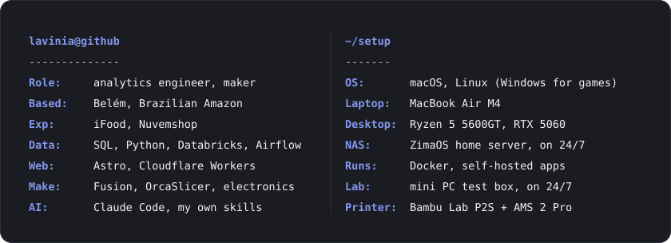
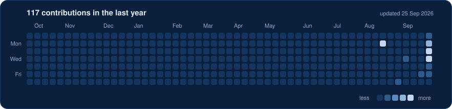

<p align="center">
  
</p>

<p align="center">
  Analytics engineer and maker from Belém, in the Brazilian Amazon.<br/><br/>
  I build data products end to end (modeling, ETL, analytics products), previously at iFood and Nuvemshop.<br/>
  Outside data, I mix code, electronics, 3D printing and design to make things that are easy to use and good to look at.
</p>

<p align="center">
  <a href="https://lavinialencar.com.br/en/"></a>
  <a href="https://lavinialencar.com.br/en/freela/"></a>
</p>

<br/>

<p align="center">
  
</p>

### Stack

<p>
  
</p>
<p>
  
  
  
  
  
</p>

### What I'm building

<details>
<summary><b>3d-print-workflow</b> · AI-assisted 3D printing, from model to printer</summary>
<br/>

A workflow for any printer, with a tested Bambu Lab track: a monitor that sends phone alerts, a Studio-to-Orca profile converter, a conductor skill that walks the cycle in order, and docs.

| | |
|---|---|
| **Stack** | Python, Make, OrcaSlicer, Bambu Lab P2S |
| **Repo** | [lavinialencar/3d-print-workflow](https://github.com/lavinialencar/3d-print-workflow) |

</details>

<details>
<summary><b>smart-coffee-scale</b> · pour-over scale that guides every pour (concept)</summary>
<br/>

A coffee scale that builds the recipe from the taste you want and guides the brew on its own screen: when to pour, how much, when it is done, and what to change next time. Designed and simulated, prototype next.

| | |
|---|---|
| **Stack** | ESP32-S3, HX711, 2.8" IPS, Fusion, PETG |
| **Repo** | [lavinialencar/smart-coffee-scale](https://github.com/lavinialencar/smart-coffee-scale) |

</details>

<details>
<summary><b>meridian</b> · personal productivity system in a single HTML file</summary>
<br/>

A unified personal productivity system that lives in one file. Local-first, zero build, zero dependencies: open it in the browser and it works.

| | |
|---|---|
| **Stack** | HTML, CSS, vanilla JavaScript, browser storage |
| **Repo** | [lavinialencar/meridian](https://github.com/lavinialencar/meridian) |

</details>

<details>
<summary><b>eda-journey</b> · interactive exploratory data analysis guide</summary>
<br/>

A five-phase EDA guide. Upload a local CSV and walk through it step by step, with a collaborative skill to pair on the analysis.

| | |
|---|---|
| **Stack** | HTML, JavaScript, local CSV parsing |
| **Repo** | [lavinialencar/eda-journey](https://github.com/lavinialencar/eda-journey) |

</details>

<details>
<summary><b>cafuacu-landing</b> · website of Cafuaçu, a specialty coffee newsletter</summary>
<br/>

The landing page of Cafuaçu, a newsletter about specialty coffee in Brazil. Static, fast, deployed on every push to main.

| | |
|---|---|
| **Stack** | Astro, Cloudflare Pages |
| **Repo** | [lavinialencar/cafuacu-landing](https://github.com/lavinialencar/cafuacu-landing) |

</details>

### Activity

<p align="center">
  
</p>

### Current focus

```yaml
focus:     3d-print-workflow, the AI conductor skill for my Bambu Lab P2S
           smart-coffee-scale, a pour-over scale that guides every pour
learning:  firmware on ESP32, agent design
open_to:   remote data projects, lavinialencar.com.br
```

<p align="center">
  
</p>
